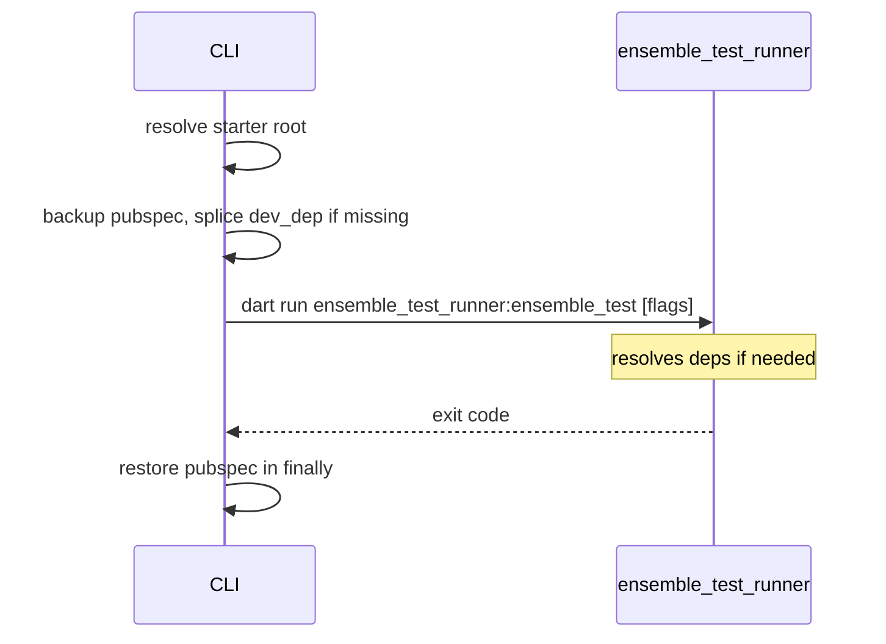

# `ensemble test`

Thin wrapper around [`ensemble_test_runner`](https://github.com/EnsembleUI/ensemble/tree/support-test-cases/packages/ensemble_test_runner). Splices a temporary dev dependency, runs tests, restores `pubspec.yaml`.

```bash
ensemble test [--project <path>] [runner flags...]
```

- Run from **starter root** or **`ensemble/apps/<app>`** (not subdirs). From an app dir, starter root is 2 parents up (`apps` → `ensemble` → starter).
- `--project` sets starter root explicitly. All other flags pass through (`--timeout=`, `--verbose`, `--doctor`, etc.).
- Uses `fvm dart` when `.fvmrc` exists. Requires Flutter **≥ 3.35**.

---

## Architecture

```
test.ts
  ├── starterProject.ts       starter root or ensemble/apps/<app>
  ├── pubspecTestRunner.ts    splice/restore ensemble_test_runner dev_dep
  └── dartToolchain.ts        fvm dart when .fvmrc exists
```



| Module                 | Role                                                                     |
| ---------------------- | ------------------------------------------------------------------------ |
| `starterProject.ts`    | Resolve starter root from cwd or 2 parents up from `ensemble/apps/<app>` |
| `pubspecTestRunner.ts` | Insert fixed git dev_dep block; restore in `finally`                     |
| `dartToolchain.ts`     | `fvm dart` vs `dart`                                                     |

**Not duplicated in CLI:** test discovery, asset patching, `flutter test`, doctor/validate — owned by the runtime package.
